# TrackBallBar キーパッド6x3拡張ユニット
キーパッド6x3拡張ユニットは、TrackBallBarに、
6x3の18キーのキーパッドを追加するユニットです。

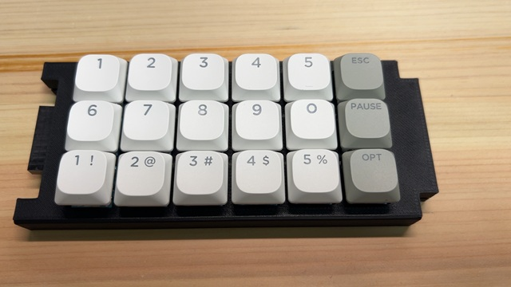
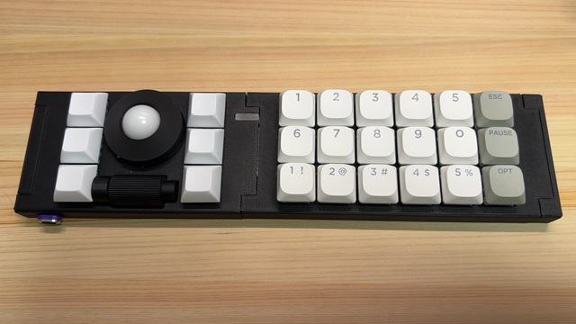

## 特徴
- 6x3の18キーのキーパッドです。
- MX互換キースイッチが使用できます。
- 接続コネクタが左に１，右に１あります。
- はんだづけが必要なキットとなります。

## パッケージ内容
- キーパッド6x3拡張ユニットケース
- コネクタキャップ(左)×1
- コネクタキャップ(右)×1
- コネクタ取り付け用治具×2
- キーパッド6x3拡張ユニット基板
- 2x10(20)ピンソケット×1
- 2x10(20)ピンヘッダ×1
- M3ラミメイトネジ×4
- ガスケット(外径7mm、内径3mm、厚2mm)×4

## 別途必要な物
- MX互換キースイッチ×18
- キーキャップ×18
- はんだこて
- はんだ

## はんだづけ作業
- 40ピン(20ピンソケットx1、20ピンヘッダx1)

## サイズ
- 幅: 150mm
- 奥行: 64mm
- 高さ: 14mm(キー含まず)

## 使用上の注意
- ケースは3Dプリンターによる自家製です。細かい傷などありましても、ご容赦ください。
- ケースはPLAで作成しています。50度ほどで変形しますので、温度には注意してください。

## 組み立て手順
1. ピンソケットにピンヘッダを差し込みます。 

2. 基板の表側の右に1のピンヘッダを差し込みます。
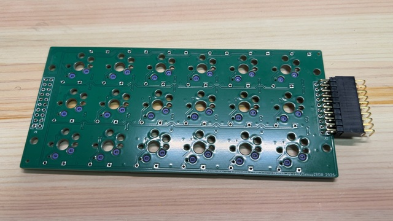
3. コネクタ取り付け用治具を基板のコネクタのあたりにはめます。 
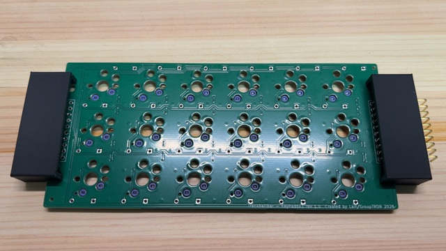
4. 基板を裏返しにします。 
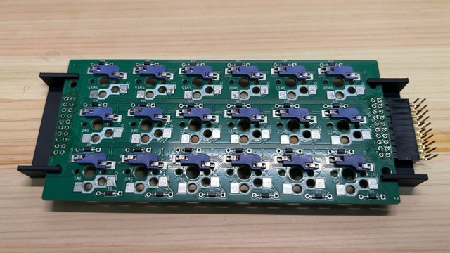
5. ピンソケットが治具に水平に載るように調整してから、はんだづけします。
6. ピンソケットを外します。
7. 基板の表側の左にピンソケットを差し込みます。 
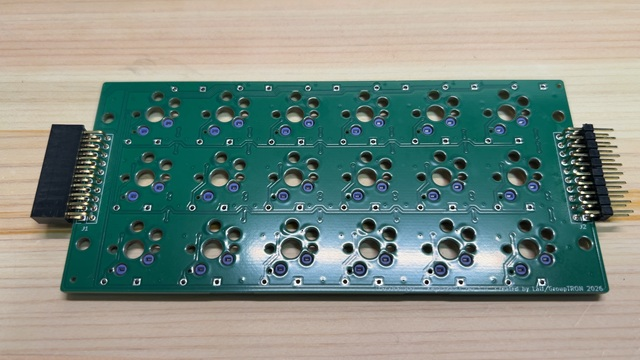
8. コネクタ取り付け用治具を基板のコネクタのあたりにはめます。 
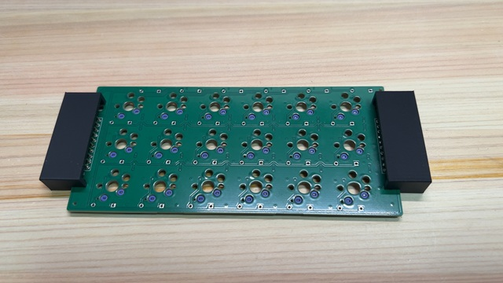
9. 基板を裏返しにします。 
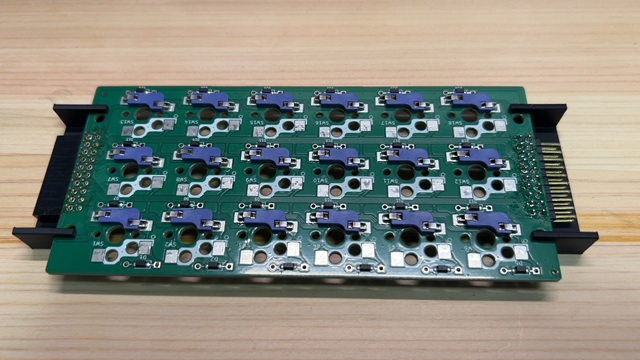
10. ピンソケットが治具に水平に載るように調整してから、はんだづけします。
11. ケースの底板のネジ穴4か所に、(気休めの)ブラケットを載せます。 
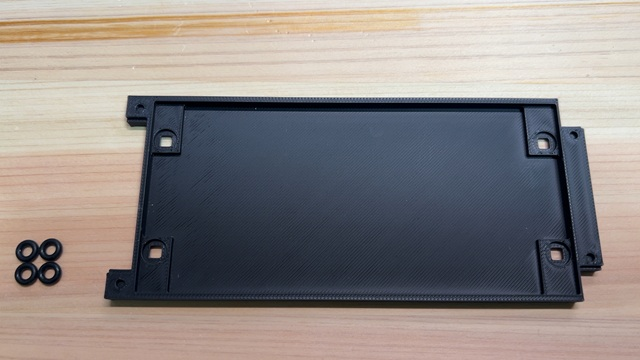
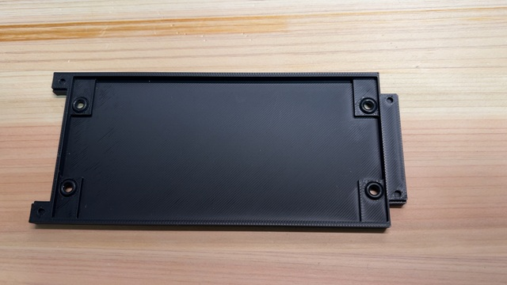
12. ケースの底板に基板を載せます。 
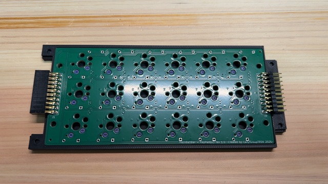
13. ケースの上板をかぶせます。 
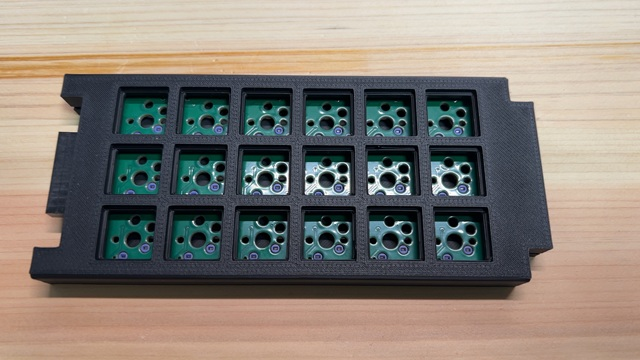
14. ケースを裏返しにし、ねじどめします。 
注意：ナットを使わず、3Dプリントしたケースに直接ねじどめするため、あまり強く締めないでください。 
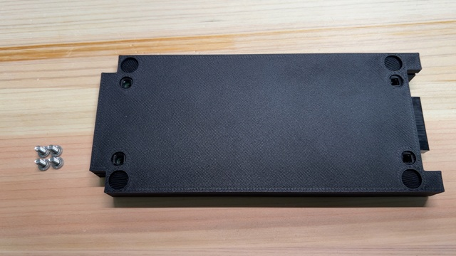
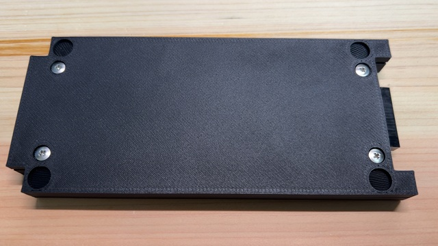
15. 裏返し、キースイッチを付けます。 
コネクタの向きに注意してください。 
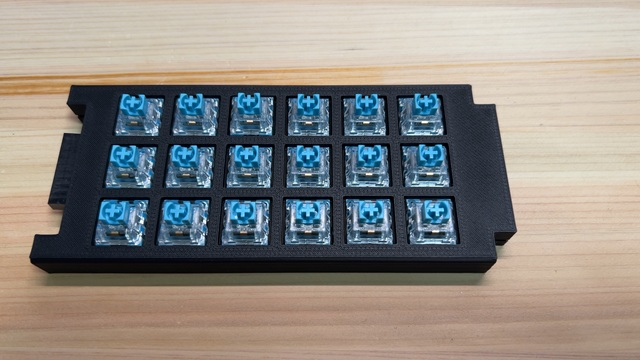
16. キーキャップを付けます。 

## キーマップ
vialでのキー位置は以下になります。
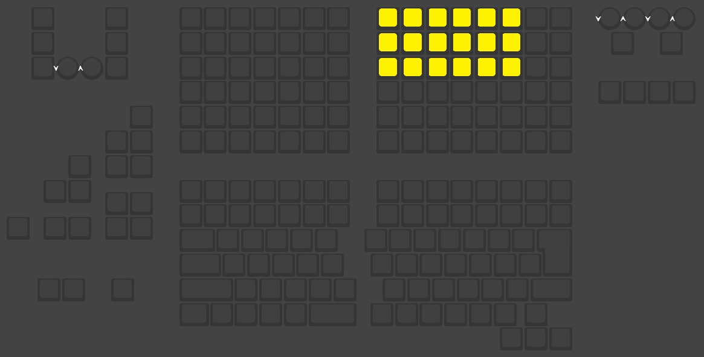

## 回路図
[回路図(PDF)](imgs/keypad6x3_rev1.0.pdf)